# App-DL

Easily grab and manage programs, choose apps from groups, control downloads, and set paths. User-friendly tool for smoother software handling.

Use the command below in a powershell terminal to open the program:

```powershell
iex(irm bit.ly/psappdl)
```

If you instead want to run it with parameters, use:

```powershell
irm bit.ly/psappdl -Outfile .\app-dl.ps1; try { .\app-dl.ps1 [parameters go here] } finally {Remove-Item .\app-dl.ps1 -force}
```

## Command line usage

You can use the program's parameters to automate the download, extraction or opening of the apps

**Syntax**

```powershell
.\app-dl.ps1
   [-app <String>]
   [-path <String>]
   [-portable <String>]
   [-open <String>]
   [-launch]
   [-usecmd]
   [-help]
```

**Examples**
--------

In the first case, it will be just a normal installation of the Brave browser, saving the installer into the desktop

```powershell
.\app-dl.ps1 -app brave -path desktop -portable n -open y

.\app-dl.ps1 -app brave -p desktop -port n -open y

.\app-dl.ps1 brave desktop n y
```

---

In the second case, it will download, extract and open the portable version of VLC

```powershell
.\app-dl.ps1 -app vlc -path downloads -portable y -open y -usecmd

.\app-dl.ps1 -app vlc -p downloads -port y -open y -usecmd

.\app-dl.ps1 vlc downloads y y -usecmd
```

---

In the last case, it will install BleachBit in your pc using the presets, saving the installer in the app's temp folder, then the installed app it will open automatically.

```powershell
.\app-dl.ps1 -app bleachbit -path appdl -portable n -open y -launch -usecmd

.\app-dl.ps1 -app bleachbit -p appdl -port n -open y -l -usecmd

.\app-dl.ps1 bleachbit appdl n y -l -usecmd
```

## Changelog

> ### App-DL v2.0

* Added command line support
* Added path aliasses for every path selection option
* General program workflow improved
* Added 7z file support
* New UI design

  * Apps now divided in categories
  * Rebuild Write-X functions: added custom padding, colors, new types
  * Changed UI colors
  * Improved way of app displaying
  * Apps tagged by supported versions (portables, installers or both)
  * Removed useless information to display to the user
* Improved stability
* Improved automation tasks
* Improved resource usage
* Improved app files managing
* Added 15 new apps
* Fixed new and old bugs
* Improved consistency of the program

  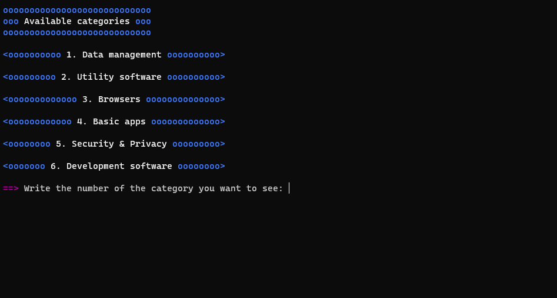
  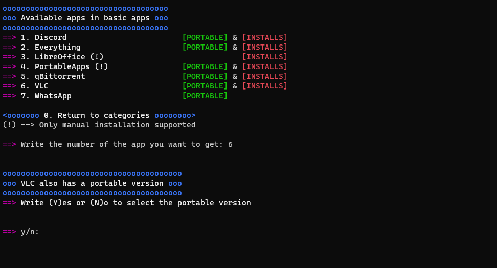
  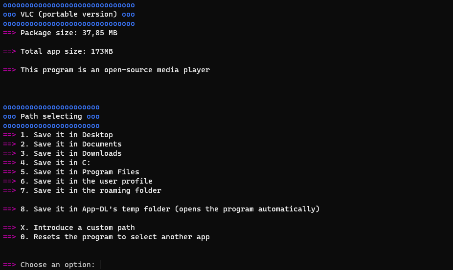
  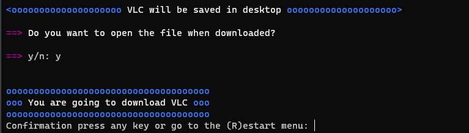
  
  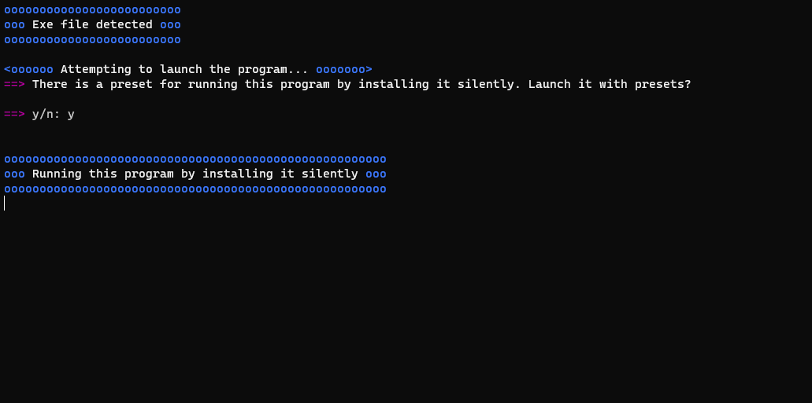

  ---

> ### App-DL v1.3

* Added app categories for the user to know what the app is related to
* Released new progress bar, displaying percent completed, download speed and total downloaded
* Fixed all known bugs
* Added 12 more apps
* Updated app versions
* Now the program supports zip, exe, msi, appx, appxbundle, msix, msixbundle files
* Improved UI response
* Improved stability
* Increased performance
* Friendly reading code
  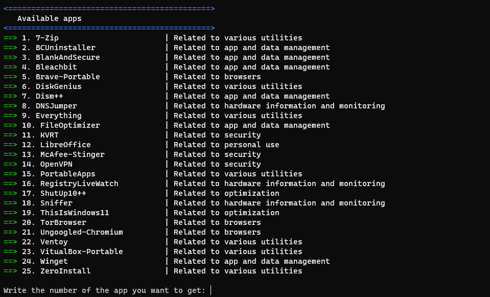
  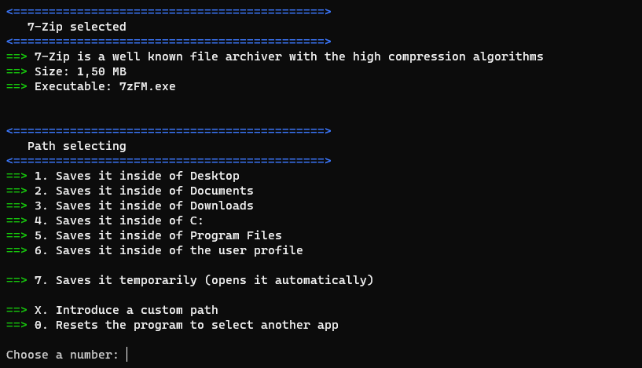
  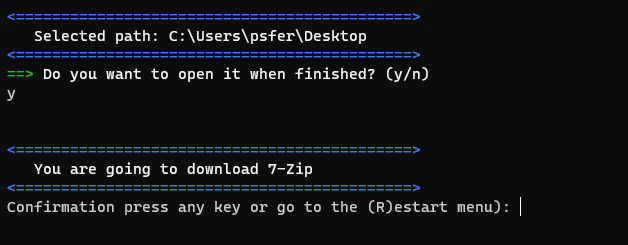
  

> ### App-DL v1.2

---

* Added app details
* Added accurate file sizes for each program
* Rewrited descriptions for every program
* Reworked UI design
* Fixed old bugs
* Cleared code by storing all functions in an isolated module
* Improved performance
* More readable code by simplifying operations

  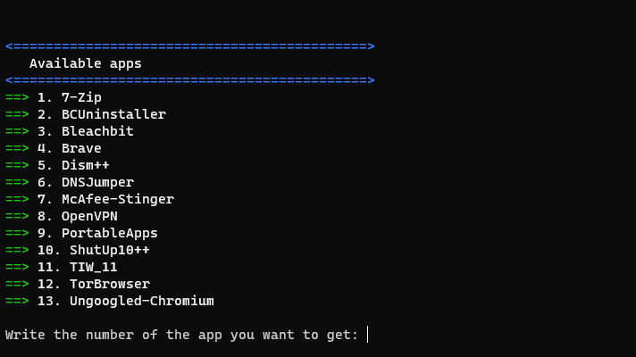

  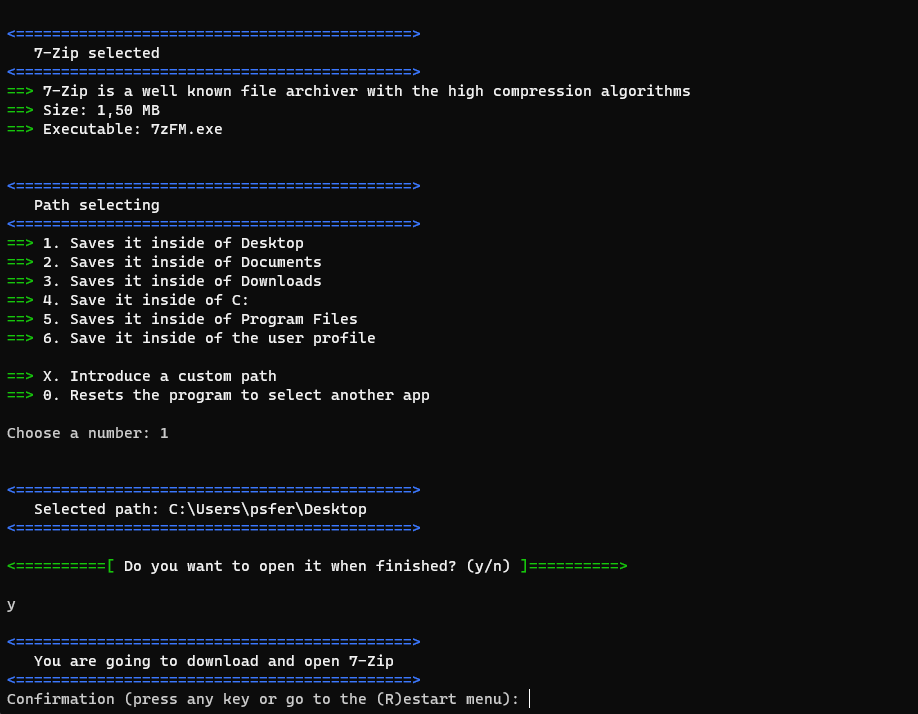
* Known bugs:

  * It only runs without problems in Powershell base, so it won't run for example in Powershell 7.
  * Confirmation line doesn't work at all yet, so if you need to restart the app, you have to restart it in other part

### App-DL v1.1

---

* Improved performance and many bugs are fixed
* Now it checks if even the package or the app are stored in the selected directory

  * Added the "open" option, which allows the user to skip the downloading steps if the app or the package is allocated in the specified path
  * Fixed the "restart" and "exit" options, which didn't appear
* Added self-explanatory descriptions for the apps
* Added recommended parameters for some apps and their corresponding description
* Added new portable apps to the library
* Functions Write-Main, Write-Secondary, Write-Point and Write-Warning are fixed when the app restarts

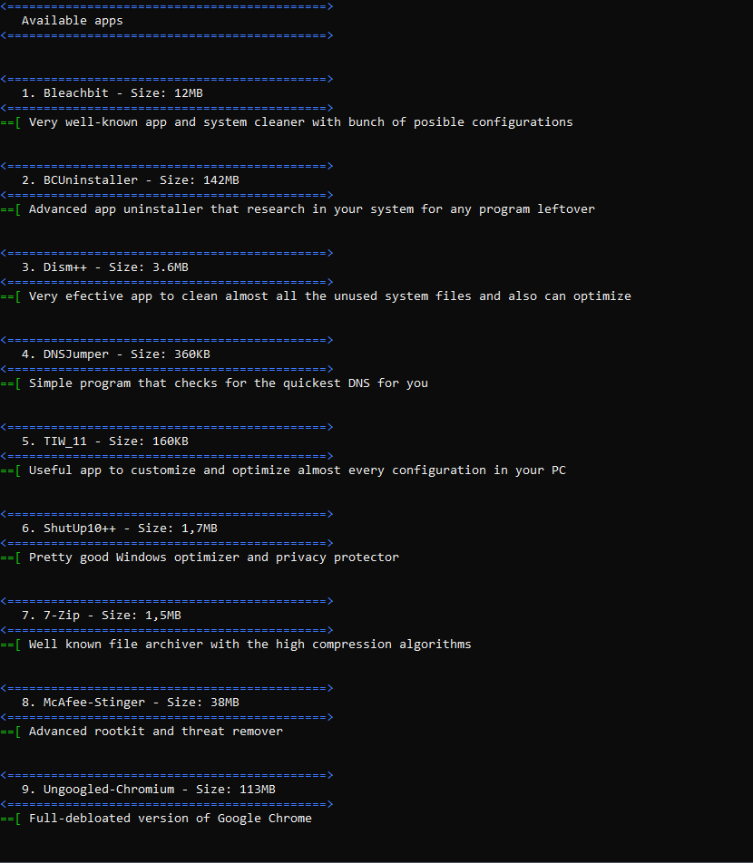

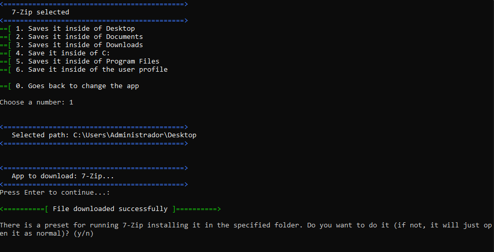

Known bugs:

* When you run 7-zip with the recommended parameters, the path assigned is shown as $path\, and not as the actual path, but the user can browse to the wanted folder

> ### App-DL v1.0 (First release)

---

* Downloads the app that the user selects
* Gives 6 paths to download

  * Desktop
  * Documents
  * Downloads
  * The system drive (normally C:\\)
  * Program Files
  * User path (C:\\users\\**\\)
* Extracts the package or installs it, whatever is a zip or an exe file.
* Looks for the executable to open it if desired

  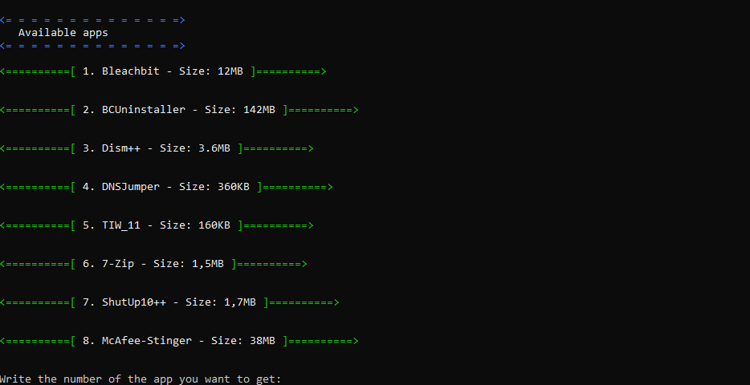

  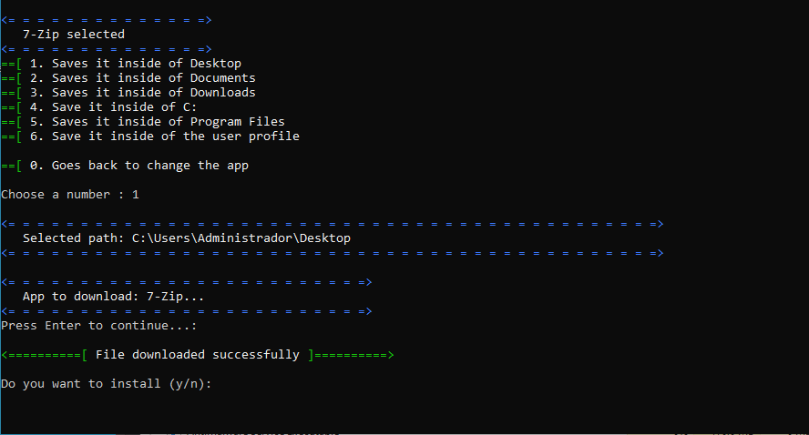
